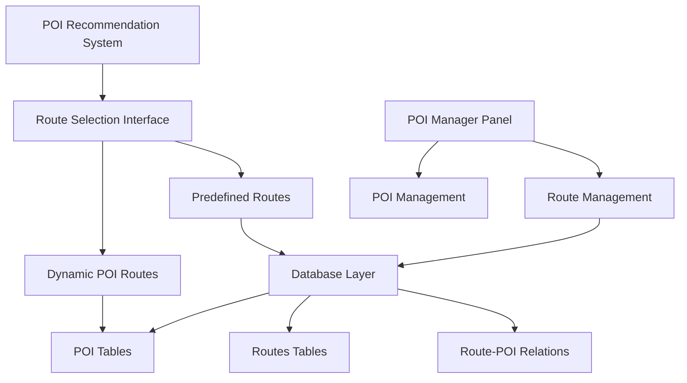
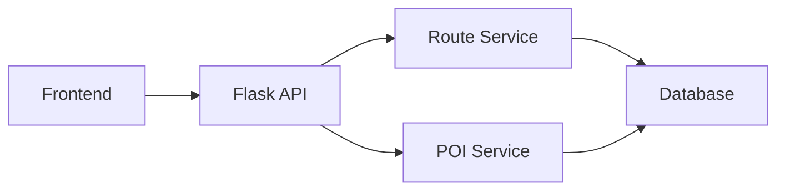

# Design Document

## Overview

Hazır rotalar sistemi, mevcut POI tabanlı dinamik rota oluşturma sistemini genişleterek, önceden hazırlanmış rotalar özelliği ekler. Sistem iki ana bileşenden oluşur:

1. **Frontend Entegrasyonu**: Mevcut POI öneri sistemine hazır rotalar sekmesi eklenmesi
2. **Admin Panel Entegrasyonu**: POI yönetim paneline rota oluşturma ve düzenleme özellikleri eklenmesi

Sistem, mevcut veritabanı şemasını kullanarak (`routes`, `route_pois`, `route_ratings` tabloları) çalışacak ve mevcut kod mimarisini bozmayacak şekilde tasarlanmıştır.

## Architecture

### System Components



### Database Schema Integration

Mevcut veritabanı şeması kullanılacak:

- **routes**: Ana rota bilgileri
- **route_pois**: Rota-POI ilişkileri
- **route_ratings**: Rota değerlendirmeleri
- **pois**: Mevcut POI verileri

### API Architecture



## Components and Interfaces

### 1. Frontend Route Selection Component

**Dosya**: `poi_recommendation_system.html` (genişletilecek)

**Yeni Bileşenler**:
- Route type tabs (Dynamic POI Routes / Predefined Routes)
- Predefined routes list component
- Route detail modal
- Route filtering interface

**Interface**:
```javascript
class RouteSelectionManager {
    constructor(containerId)
    loadPredefinedRoutes()
    filterRoutes(criteria)
    displayRouteDetails(routeId)
    selectRoute(routeId)
}
```

### 2. Admin Route Management Component

**Dosya**: `poi_manager_ui.html` (genişletilecek)

**Yeni Bileşenler**:
- Route management tab
- Route creation form
- Route editing interface
- POI selection for routes
- Route preview map

**Interface**:
```javascript
class RouteAdminManager {
    constructor(containerId)
    loadRoutes()
    createRoute(routeData)
    updateRoute(routeId, routeData)
    deleteRoute(routeId)
    managePOIAssociations(routeId, poiIds)
}
```

### 3. Backend API Extensions

**Dosya**: `poi_api.py` (genişletilecek)

**Yeni Endpoints**:
```python
# Public endpoints
@app.route('/api/routes', methods=['GET'])
def get_predefined_routes()

@app.route('/api/routes/<int:route_id>', methods=['GET'])
def get_route_details(route_id)

@app.route('/api/routes/filter', methods=['POST'])
def filter_routes()

# Admin endpoints (authentication required)
@app.route('/api/admin/routes', methods=['POST'])
def create_route()

@app.route('/api/admin/routes/<int:route_id>', methods=['PUT'])
def update_route(route_id)

@app.route('/api/admin/routes/<int:route_id>', methods=['DELETE'])
def delete_route(route_id)

@app.route('/api/admin/routes/<int:route_id>/pois', methods=['POST'])
def associate_pois_with_route(route_id)
```

### 4. Database Service Layer

**Yeni Dosya**: `route_service.py`

```python
class RouteService:
    def get_all_active_routes()
    def get_route_by_id(route_id)
    def filter_routes(filters)
    def create_route(route_data)
    def update_route(route_id, route_data)
    def delete_route(route_id)
    def associate_pois(route_id, poi_associations)
    def get_route_pois(route_id)
```

## Data Models

### Route Data Structure

```python
{
    "id": int,
    "name": str,
    "description": str,
    "route_type": str,  # walking, hiking, cycling, driving
    "difficulty_level": int,  # 1-5
    "estimated_duration": int,  # minutes
    "total_distance": float,  # km
    "elevation_gain": int,  # meters
    "is_circular": bool,
    "season_availability": list,
    "tags": str,
    "pois": [
        {
            "poi_id": int,
            "order_in_route": int,
            "is_mandatory": bool,
            "estimated_time_at_poi": int,
            "notes": str
        }
    ],
    "ratings": {
        "scenic_beauty": int,
        "historical": int,
        "cultural": int,
        "family_friendly": int,
        "photography": int
    }
}
```

### Route Filter Criteria

```python
{
    "route_type": str,  # optional
    "difficulty_level": {
        "min": int,
        "max": int
    },
    "duration": {
        "min": int,  # minutes
        "max": int
    },
    "distance": {
        "min": float,  # km
        "max": float
    },
    "tags": list,  # optional
    "season": str  # optional
}
```

## Error Handling

### Frontend Error Handling

1. **Network Errors**: Graceful degradation with cached data
2. **API Errors**: User-friendly error messages
3. **Validation Errors**: Real-time form validation feedback

### Backend Error Handling

1. **Database Connection Errors**: Fallback to default behavior
2. **Invalid Route Data**: Detailed validation error responses
3. **Authentication Errors**: Proper HTTP status codes
4. **Resource Not Found**: 404 responses with helpful messages

### Error Response Format

```python
{
    "success": false,
    "error": {
        "code": "ROUTE_NOT_FOUND",
        "message": "Belirtilen rota bulunamadı",
        "details": {}
    }
}
```

## Testing Strategy

### Unit Tests

1. **Route Service Tests**:
   - CRUD operations
   - Filter functionality
   - POI association logic

2. **API Endpoint Tests**:
   - Request/response validation
   - Authentication checks
   - Error handling

### Integration Tests

1. **Database Integration**:
   - Route creation with POI associations
   - Complex filter queries
   - Data consistency checks

2. **Frontend Integration**:
   - Route selection workflow
   - Admin route management
   - Cross-browser compatibility

### End-to-End Tests

1. **User Journey Tests**:
   - Tourist selecting predefined route
   - Admin creating and managing routes
   - Route filtering and search

2. **Performance Tests**:
   - Route loading performance
   - Map rendering with multiple routes
   - Database query optimization

## Implementation Phases

### Phase 1: Backend API Development
- Extend `poi_api.py` with route endpoints
- Create `route_service.py` for database operations
- Implement authentication for admin endpoints

### Phase 2: Frontend Route Selection
- Add route type tabs to POI recommendation system
- Implement predefined routes listing
- Create route detail modal and filtering

### Phase 3: Admin Route Management
- Add route management tab to POI manager
- Implement route creation and editing forms
- Add POI association interface

### Phase 4: Integration and Testing
- Integrate all components
- Comprehensive testing
- Performance optimization

## Security Considerations

1. **Authentication**: Admin endpoints require proper authentication
2. **Input Validation**: All route data validated before database operations
3. **SQL Injection Prevention**: Parameterized queries for all database operations
4. **XSS Prevention**: Proper output encoding in frontend
5. **CSRF Protection**: CSRF tokens for admin operations

## Performance Considerations

1. **Database Indexing**: Proper indexes on route filtering columns
2. **Caching**: Route data caching for frequently accessed routes
3. **Lazy Loading**: Route details loaded on demand
4. **Map Optimization**: Efficient route geometry rendering
5. **API Pagination**: Large route lists paginated

## Backward Compatibility

1. **Existing POI System**: No changes to existing POI recommendation logic
2. **Database Schema**: Uses existing route tables without modifications
3. **API Compatibility**: New endpoints don't affect existing ones
4. **Frontend Compatibility**: New features added as extensions, not replacements