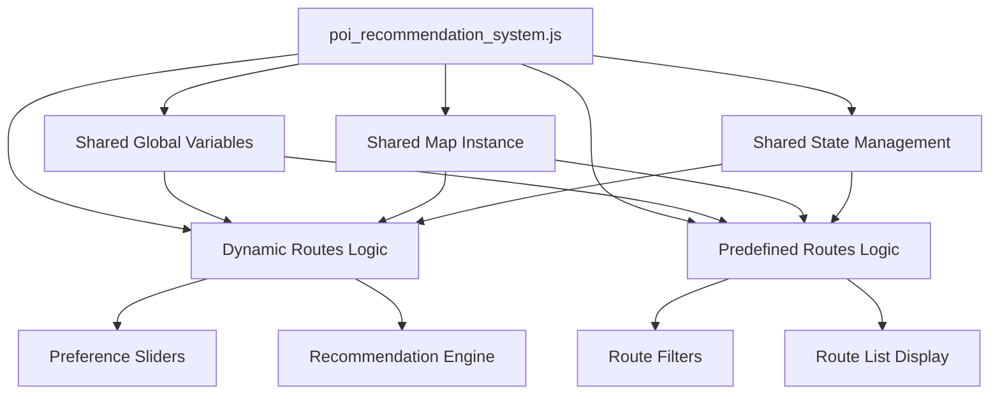
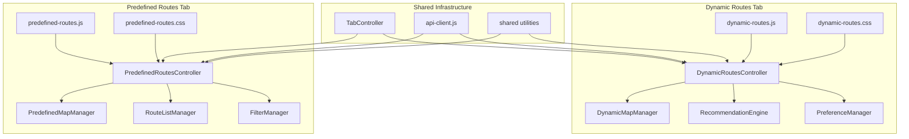
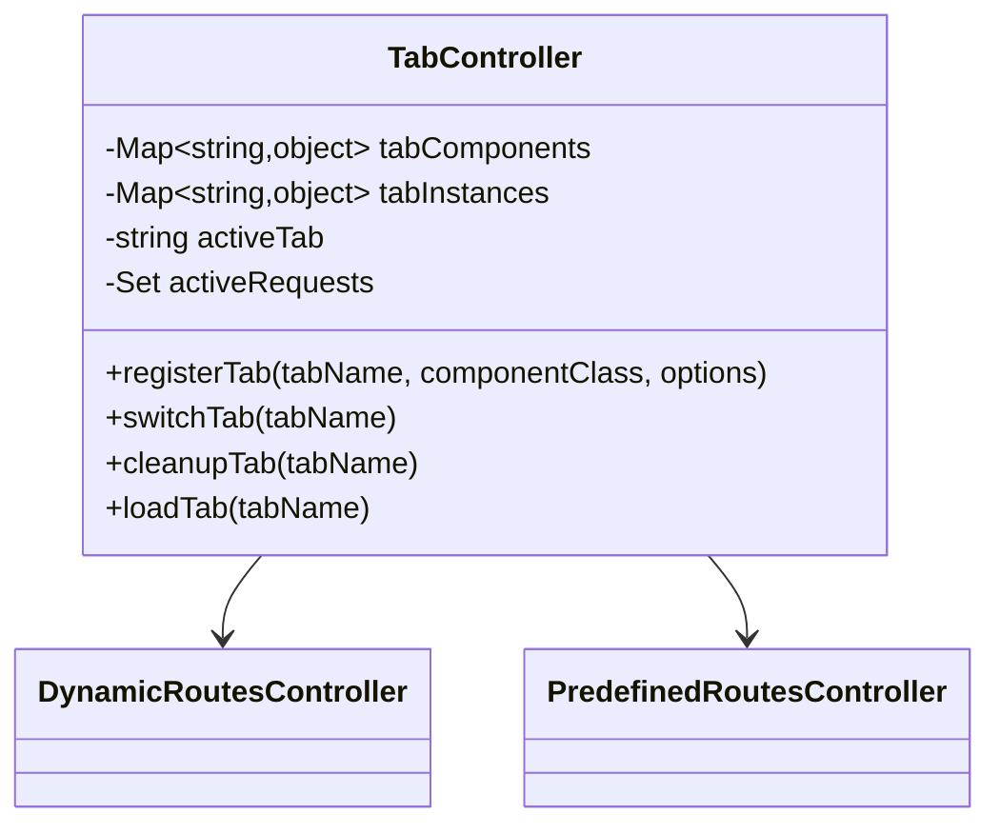
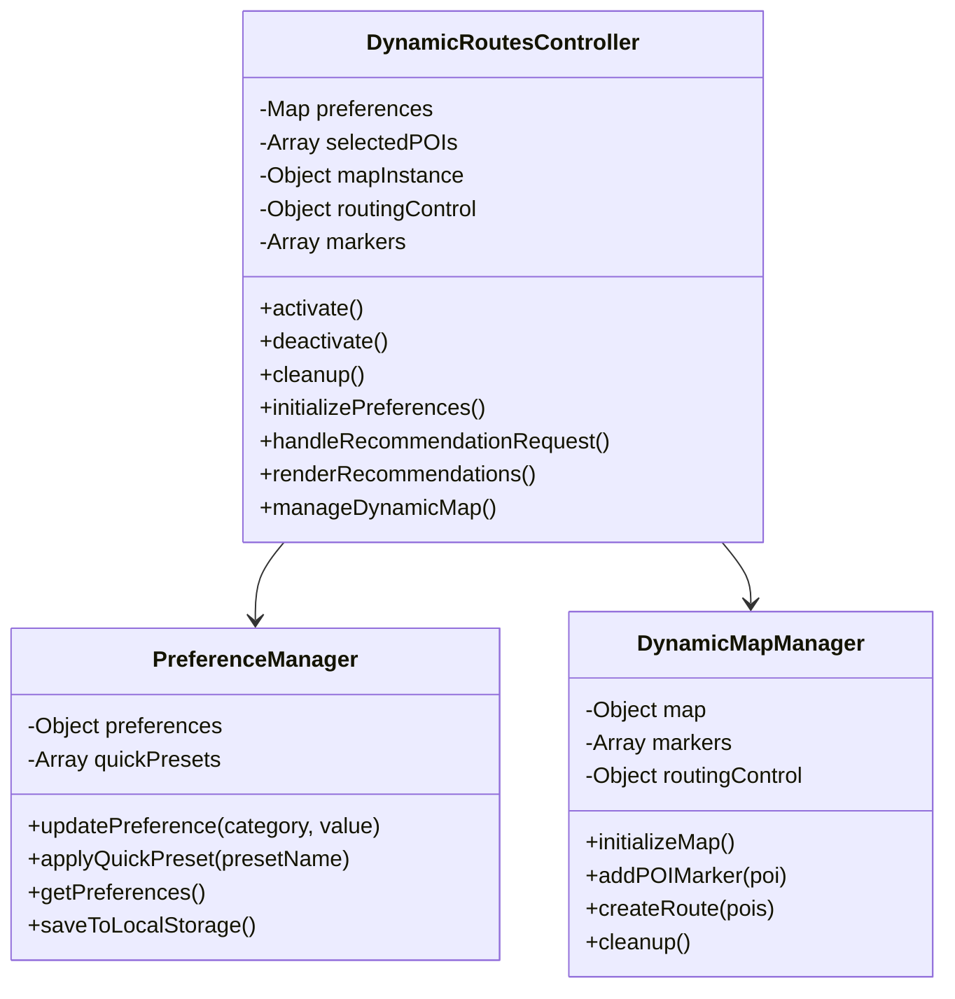
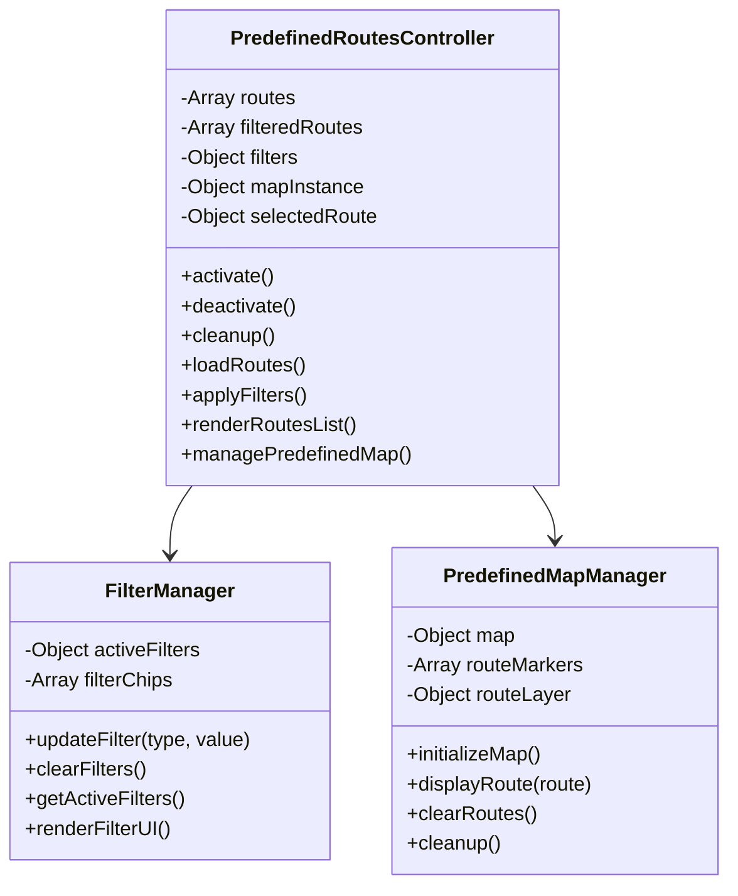

# POI Recommendation System Tab Separation Design

## Overview

This design document outlines the separation of the POI recommendation system into two independent tab components: **Dynamic Routes Tab** and **Predefined Routes Tab**. The goal is to achieve complete independence between the two tabs while maintaining the exact same user interface, design, and functionality.

## Current Architecture Analysis

The current implementation in `poi_recommendation_system.html` uses a single monolithic JavaScript file (`poi_recommendation_system.js`) that handles both tabs with shared:

- Global variables (`map`, `markers`, `currentTab`, etc.)
- Shared functions (`switchTab`, `initializeRouteTabs`, etc.)
- Mixed state management for both dynamic and predefined routes
- Single CSS file with combined styles



## Target Architecture

The new architecture will completely separate the tabs into independent components with:

- Isolated JavaScript modules
- Independent state management
- Separate CSS files with no global conflicts
- Independent memory management
- No shared global variables between tabs



## Component Architecture

### 1. Tab Controller

The existing `TabController` class will orchestrate the tab switching and component lifecycle:



### 2. Dynamic Routes Component

Independent component handling personal preference-based route generation:



### 3. Predefined Routes Component

Independent component handling pre-defined route display and filtering:



## State Isolation Strategy

### 1. Memory Isolation

Each tab component will have its own isolated state:

| Dynamic Routes Tab | Predefined Routes Tab |
|-------------------|----------------------|
| `dynamicPreferences` | `predefinedFilters` |
| `dynamicMap` | `predefinedMap` |
| `dynamicMarkers` | `predefinedRouteMarkers` |
| `selectedPOIs` | `filteredRoutes` |
| `dynamicRoutingControl` | `selectedRoute` |

### 2. Event Isolation

Each component will manage its own event listeners and cleanup:

```javascript
// Dynamic Routes Component
class DynamicRoutesController {
    activate() {
        this.setupEventListeners();
        this.initializeMap();
        this.loadPreferences();
    }
    
    deactivate() {
        this.cleanupEventListeners();
        this.saveState();
    }
    
    cleanup() {
        this.destroyMap();
        this.clearTimeouts();
        this.removeEventListeners();
    }
}
```

### 3. CSS Isolation

Each tab will have its own CSS file with scoped selectors:

```css
/* dynamic-routes.css */
.tab-content[data-tab="dynamic-routes"] .preference-item {
    /* Dynamic routes specific styles */
}

/* predefined-routes.css */
.tab-content[data-tab="predefined-routes"] .route-card {
    /* Predefined routes specific styles */
}
```

## File Structure

```
static/js/poi-tabs/
├── shared/
│   ├── utils.js                    # Shared utilities
│   ├── constants.js                # Shared constants
│   └── base-controller.js          # Base controller class
├── dynamic-routes/
│   ├── dynamic-routes.js           # Main dynamic routes controller
│   ├── preference-manager.js       # Preference handling
│   └── dynamic-map-manager.js      # Dynamic routes map management
├── predefined-routes/
│   ├── predefined-routes.js        # Main predefined routes controller
│   ├── filter-manager.js           # Filter handling
│   └── predefined-map-manager.js   # Predefined routes map management
└── tab-controller.js               # Main tab controller (existing)

static/css/
├── poi-tabs/
│   ├── shared.css                  # Shared tab styles
│   ├── dynamic-routes.css          # Dynamic routes specific styles
│   └── predefined-routes.css       # Predefined routes specific styles
```

## Implementation Steps

### Phase 1: Component Structure Setup

1. **Create base component classes**
   - `BaseTabController` with common lifecycle methods
   - Shared utilities and constants

2. **Extract dynamic routes functionality**
   - Create `DynamicRoutesController` class
   - Move preference management to `PreferenceManager`
   - Create independent map management for dynamic routes

3. **Extract predefined routes functionality**
   - Create `PredefinedRoutesController` class
   - Move filter management to `FilterManager`
   - Create independent map management for predefined routes

### Phase 2: State Isolation

1. **Isolate global variables**
   - Move all shared variables into respective component scopes
   - Ensure no cross-tab variable access

2. **Independent map instances**
   - Create separate map instances for each tab
   - Implement independent cleanup procedures

3. **Event listener isolation**
   - Move all event listeners into component-specific methods
   - Implement proper cleanup on tab switches

### Phase 3: CSS Separation

1. **Split CSS files**
   - Extract dynamic routes styles to separate file
   - Extract predefined routes styles to separate file
   - Maintain shared styles in common file

2. **Scope CSS selectors**
   - Add tab-specific prefixes to avoid conflicts
   - Ensure responsive design remains intact

### Phase 4: Integration and Testing

1. **Integrate with TabController**
   - Register both components with the tab controller
   - Test tab switching functionality

2. **Performance testing**
   - Verify memory cleanup works correctly
   - Test for memory leaks between tab switches

3. **UI/UX verification**
   - Ensure identical visual appearance
   - Test all interactive features in both tabs

## Testing Strategy

### 1. Functional Testing

- **Tab Switching**: Verify smooth transitions between tabs
- **State Isolation**: Confirm no data bleeding between tabs
- **Memory Management**: Test cleanup on tab switches
- **Feature Parity**: Ensure all original features work identically

### 2. Visual Testing

- **Design Consistency**: Compare before/after screenshots
- **Responsive Behavior**: Test on different screen sizes
- **Animation Continuity**: Verify smooth transitions
- **Component Rendering**: Check for layout issues

### 3. Performance Testing

- **Memory Usage**: Monitor for memory leaks
- **Load Times**: Measure component initialization times
- **Resource Cleanup**: Verify proper cleanup of resources
- **Event Listener Management**: Test for orphaned listeners

## Implementation Details

### Dynamic Routes Component

```javascript
class DynamicRoutesController {
    constructor(options = {}) {
        this.preferences = new Map();
        this.selectedPOIs = [];
        this.mapManager = null;
        this.preferenceManager = null;
        this.isActive = false;
    }

    async activate() {
        if (this.isActive) return;
        
        console.log('🔄 Activating Dynamic Routes Tab');
        
        // Initialize managers
        this.preferenceManager = new PreferenceManager();
        this.mapManager = new DynamicMapManager('mapContainer');
        
        // Setup UI
        await this.initializePreferences();
        await this.mapManager.initialize();
        
        // Setup event listeners
        this.setupEventListeners();
        
        this.isActive = true;
        console.log('✅ Dynamic Routes Tab activated');
    }

    async deactivate() {
        if (!this.isActive) return;
        
        console.log('🔄 Deactivating Dynamic Routes Tab');
        
        // Save current state
        this.saveState();
        
        // Cleanup event listeners
        this.removeEventListeners();
        
        this.isActive = false;
        console.log('✅ Dynamic Routes Tab deactivated');
    }

    cleanup() {
        console.log('🧹 Cleaning up Dynamic Routes Tab');
        
        // Cleanup map
        if (this.mapManager) {
            this.mapManager.cleanup();
            this.mapManager = null;
        }
        
        // Cleanup preferences
        if (this.preferenceManager) {
            this.preferenceManager.cleanup();
            this.preferenceManager = null;
        }
        
        // Clear data
        this.selectedPOIs = [];
        this.preferences.clear();
        
        console.log('✅ Dynamic Routes Tab cleanup complete');
    }
}
```

### Predefined Routes Component

```javascript
class PredefinedRoutesController {
    constructor(options = {}) {
        this.routes = [];
        this.filteredRoutes = [];
        this.mapManager = null;
        this.filterManager = null;
        this.selectedRoute = null;
        this.isActive = false;
    }

    async activate() {
        if (this.isActive) return;
        
        console.log('🔄 Activating Predefined Routes Tab');
        
        // Initialize managers
        this.filterManager = new FilterManager();
        this.mapManager = new PredefinedMapManager('predefinedRoutesMap');
        
        // Load data and setup UI
        await this.loadRoutes();
        await this.mapManager.initialize();
        this.setupFilters();
        
        // Setup event listeners
        this.setupEventListeners();
        
        this.isActive = true;
        console.log('✅ Predefined Routes Tab activated');
    }

    async deactivate() {
        if (!this.isActive) return;
        
        console.log('🔄 Deactivating Predefined Routes Tab');
        
        // Save current state
        this.saveState();
        
        // Cleanup event listeners
        this.removeEventListeners();
        
        this.isActive = false;
        console.log('✅ Predefined Routes Tab deactivated');
    }

    cleanup() {
        console.log('🧹 Cleaning up Predefined Routes Tab');
        
        // Cleanup map
        if (this.mapManager) {
            this.mapManager.cleanup();
            this.mapManager = null;
        }
        
        // Cleanup filters
        if (this.filterManager) {
            this.filterManager.cleanup();
            this.filterManager = null;
        }
        
        // Clear data
        this.routes = [];
        this.filteredRoutes = [];
        this.selectedRoute = null;
        
        console.log('✅ Predefined Routes Tab cleanup complete');
    }
}
```

## Implementation Files

### Step 1: Create Shared Utilities

**File: `static/js/poi-tabs/shared/utils.js`**

```javascript
/**
 * Shared utilities for POI tabs
 * Common functions used by both dynamic and predefined routes tabs
 */

// API base URL
export const API_BASE = '/api';

// Media display configuration
export const MEDIA_CONFIG = {
    useFallbackContent: true,
    fallbackTimeout: 10000,
    showPlaceholderImages: false
};

// Rating categories with their display names and icons
export const RATING_CATEGORIES = {
    'doga': { name: 'Doğa', icon: 'fas fa-tree' },
    'yemek': { name: 'Yemek', icon: 'fas fa-utensils' },
    'tarihi': { name: 'Tarih', icon: 'fas fa-landmark' },
    'eglence': { name: 'Eğlence', icon: 'fas fa-gamepad' },
    'sanat_kultur': { name: 'Sanat & Kültür', icon: 'fas fa-palette' },
    'macera': { name: 'Macera', icon: 'fas fa-mountain' },
    'rahatlatici': { name: 'Rahatlatıcı', icon: 'fas fa-spa' },
    'spor': { name: 'Spor', icon: 'fas fa-running' },
    'alisveris': { name: 'Alışveriş', icon: 'fas fa-shopping-bag' },
    'gece_hayati': { name: 'Gece Hayatı', icon: 'fas fa-moon' }
};

// ... (other constants from original file)

/**
 * Show notification to user
 */
export function showNotification(message, type = 'info') {
    if (window.uiComponents && window.uiComponents.showToast) {
        window.uiComponents.showToast(message, type);
    } else {
        console.log(`${type.toUpperCase()}: ${message}`);
        alert(message);
    }
}

// ... (other utility functions)
```

### Step 2: Create Base Controller

**File: `static/js/poi-tabs/shared/base-controller.js`**

```javascript
/**
 * Base controller class for tab components
 */
export class BaseTabController {
    constructor(options = {}) {
        this.isActive = false;
        this.isInitialized = false;
        this.eventListeners = new Map();
        this.timeouts = new Set();
        this.intervals = new Set();
        this.requests = new Set();
        this.options = options;
    }

    /**
     * Activate the tab component
     */
    async activate() {
        if (this.isActive) return;
        
        console.log(`🔄 Activating ${this.constructor.name}`);
        
        try {
            await this.onActivate();
            this.isActive = true;
            console.log(`✅ ${this.constructor.name} activated`);
        } catch (error) {
            console.error(`❌ Error activating ${this.constructor.name}:`, error);
            throw error;
        }
    }

    /**
     * Deactivate the tab component
     */
    async deactivate() {
        if (!this.isActive) return;
        
        console.log(`🔄 Deactivating ${this.constructor.name}`);
        
        try {
            await this.onDeactivate();
            this.isActive = false;
            console.log(`✅ ${this.constructor.name} deactivated`);
        } catch (error) {
            console.error(`❌ Error deactivating ${this.constructor.name}:`, error);
        }
    }

    /**
     * Cleanup all resources
     */
    cleanup() {
        console.log(`🧹 Cleaning up ${this.constructor.name}`);
        
        this.clearTimeouts();
        this.clearIntervals();
        this.abortRequests();
        this.removeAllEventListeners();
        
        this.onCleanup();
        
        this.isActive = false;
        this.isInitialized = false;
        
        console.log(`✅ ${this.constructor.name} cleanup complete`);
    }

    // Abstract methods to be implemented by subclasses
    async onActivate() { throw new Error('onActivate must be implemented'); }
    async onDeactivate() { throw new Error('onDeactivate must be implemented'); }
    onCleanup() { throw new Error('onCleanup must be implemented'); }

    // Helper methods for resource management
    addTimeout(callback, delay) {
        const id = setTimeout(() => {
            this.timeouts.delete(id);
            callback();
        }, delay);
        this.timeouts.add(id);
        return id;
    }

    clearTimeouts() {
        this.timeouts.forEach(id => clearTimeout(id));
        this.timeouts.clear();
    }

    addEventListener(element, event, handler) {
        const key = `${element}_${event}`;
        this.eventListeners.set(key, { element, event, handler });
        element.addEventListener(event, handler);
    }

    removeAllEventListeners() {
        this.eventListeners.forEach(({ element, event, handler }) => {
            element.removeEventListener(event, handler);
        });
        this.eventListeners.clear();
    }
}
```

### Step 3: Create Dynamic Routes Component

**File: `static/js/poi-tabs/dynamic-routes/dynamic-routes.js`**

```javascript
import { BaseTabController } from '../shared/base-controller.js';
import { API_BASE, showNotification, RATING_CATEGORIES } from '../shared/utils.js';
import { PreferenceManager } from './preference-manager.js';
import { DynamicMapManager } from './dynamic-map-manager.js';

/**
 * Dynamic Routes Tab Controller
 * Handles personal preference-based route generation
 */
export class DynamicRoutesController extends BaseTabController {
    constructor(options = {}) {
        super(options);
        
        this.preferenceManager = null;
        this.mapManager = null;
        this.selectedPOIs = [];
        this.recommendations = [];
        this.routingControl = null;
    }

    async onActivate() {
        // Initialize managers
        this.preferenceManager = new PreferenceManager();
        this.mapManager = new DynamicMapManager('mapContainer');
        
        // Setup UI components
        await this.initializePreferences();
        await this.mapManager.initialize();
        
        // Setup event listeners
        this.setupEventListeners();
        
        // Load saved preferences
        await this.loadUserPreferences();
    }

    async onDeactivate() {
        // Save current state
        await this.saveUserPreferences();
        
        // Hide results if showing
        this.hideResults();
    }

    onCleanup() {
        // Cleanup managers
        if (this.mapManager) {
            this.mapManager.cleanup();
            this.mapManager = null;
        }
        
        if (this.preferenceManager) {
            this.preferenceManager.cleanup();
            this.preferenceManager = null;
        }
        
        // Clear data
        this.selectedPOIs = [];
        this.recommendations = [];
        this.routingControl = null;
    }

    setupEventListeners() {
        const recommendBtn = document.getElementById('recommendBtn');
        if (recommendBtn) {
            this.addEventListener(recommendBtn, 'click', () => {
                this.handleRecommendationRequest();
            });
        }

        // Quick preset buttons
        const quickBtns = document.querySelectorAll('.quick-btn[data-preset]');
        quickBtns.forEach(btn => {
            this.addEventListener(btn, 'click', (e) => {
                const preset = e.target.closest('[data-preset]').dataset.preset;
                this.preferenceManager.applyQuickPreset(preset);
            });
        });
    }

    async initializePreferences() {
        const sliders = document.querySelectorAll('.preference-slider');
        
        sliders.forEach(slider => {
            this.addEventListener(slider, 'input', (e) => {
                this.preferenceManager.updatePreference(e.target.id, e.target.value);
            });
        });
    }

    async handleRecommendationRequest() {
        try {
            this.showLoading();
            
            const preferences = this.preferenceManager.getPreferences();
            const response = await fetch(`${API_BASE}/recommendations`, {
                method: 'POST',
                headers: { 'Content-Type': 'application/json' },
                body: JSON.stringify({ preferences })
            });
            
            if (!response.ok) {
                throw new Error('Failed to get recommendations');
            }
            
            const data = await response.json();
            this.recommendations = data.recommendations || [];
            
            this.renderRecommendations();
            await this.updateMap();
            
        } catch (error) {
            console.error('Error getting recommendations:', error);
            showNotification('Öneriler alınırken hata oluştu', 'error');
        } finally {
            this.hideLoading();
        }
    }

    renderRecommendations() {
        const container = document.getElementById('recommendationResults');
        if (!container) return;
        
        // Implementation for rendering recommendations
        // ... (similar to original implementation but isolated)
    }

    async updateMap() {
        if (!this.mapManager) return;
        
        // Clear existing markers
        this.mapManager.clearMarkers();
        
        // Add POI markers
        this.recommendations.forEach(poi => {
            this.mapManager.addPOIMarker(poi);
        });
        
        // Fit map to show all POIs
        this.mapManager.fitToMarkers();
    }

    showLoading() {
        const indicator = document.getElementById('loadingIndicator');
        if (indicator) indicator.style.display = 'flex';
    }

    hideLoading() {
        const indicator = document.getElementById('loadingIndicator');
        if (indicator) indicator.style.display = 'none';
    }

    hideResults() {
        const results = document.getElementById('resultsSection');
        if (results) results.style.display = 'none';
    }

    async loadUserPreferences() {
        try {
            const saved = localStorage.getItem('dynamic-routes-preferences');
            if (saved) {
                const preferences = JSON.parse(saved);
                this.preferenceManager.setPreferences(preferences);
            }
        } catch (error) {
            console.warn('Could not load saved preferences:', error);
        }
    }

    async saveUserPreferences() {
        try {
            const preferences = this.preferenceManager.getPreferences();
            localStorage.setItem('dynamic-routes-preferences', JSON.stringify(preferences));
        } catch (error) {
            console.warn('Could not save preferences:', error);
        }
    }
}
```

### Step 4: Create Predefined Routes Component

**File: `static/js/poi-tabs/predefined-routes/predefined-routes.js`**

```javascript
import { BaseTabController } from '../shared/base-controller.js';
import { API_BASE, showNotification } from '../shared/utils.js';
import { FilterManager } from './filter-manager.js';
import { PredefinedMapManager } from './predefined-map-manager.js';

/**
 * Predefined Routes Tab Controller
 * Handles pre-defined route display and filtering
 */
export class PredefinedRoutesController extends BaseTabController {
    constructor(options = {}) {
        super(options);
        
        this.filterManager = null;
        this.mapManager = null;
        this.routes = [];
        this.filteredRoutes = [];
        this.selectedRoute = null;
        this.isLoading = false;
    }

    async onActivate() {
        // Initialize managers
        this.filterManager = new FilterManager();
        this.mapManager = new PredefinedMapManager('predefinedRoutesMap');
        
        // Setup UI components
        await this.mapManager.initialize();
        this.setupFilters();
        
        // Setup event listeners
        this.setupEventListeners();
        
        // Load routes
        await this.loadRoutes();
    }

    async onDeactivate() {
        // Save current state
        this.saveState();
    }

    onCleanup() {
        // Cleanup managers
        if (this.mapManager) {
            this.mapManager.cleanup();
            this.mapManager = null;
        }
        
        if (this.filterManager) {
            this.filterManager.cleanup();
            this.filterManager = null;
        }
        
        // Clear data
        this.routes = [];
        this.filteredRoutes = [];
        this.selectedRoute = null;
    }

    setupEventListeners() {
        // Route search
        const searchInput = document.getElementById('routeSearchInput');
        if (searchInput) {
            this.addEventListener(searchInput, 'input', (e) => {
                this.handleSearch(e.target.value);
            });
        }

        // Filter chips
        const filterChips = document.querySelectorAll('.filter-chip');
        filterChips.forEach(chip => {
            this.addEventListener(chip, 'click', (e) => {
                this.handleFilterChip(e.target.closest('.filter-chip'));
            });
        });

        // Map controls
        const clearMapBtn = document.getElementById('clearMapBtn');
        if (clearMapBtn) {
            this.addEventListener(clearMapBtn, 'click', () => {
                this.mapManager.clearRoutes();
            });
        }

        const fitMapBtn = document.getElementById('fitMapBtn');
        if (fitMapBtn) {
            this.addEventListener(fitMapBtn, 'click', () => {
                this.mapManager.fitToRoutes();
            });
        }
    }

    async loadRoutes() {
        if (this.isLoading) return;
        
        this.isLoading = true;
        this.showLoadingState();

        try {
            const response = await fetch(`${API_BASE}/routes`);
            
            if (!response.ok) {
                throw new Error('Failed to load routes');
            }
            
            const data = await response.json();
            
            if (data.success) {
                this.routes = data.routes || [];
                this.filteredRoutes = [...this.routes];
                
                this.renderRoutesList();
                this.updateRouteCount();
                
                console.log(`✅ Loaded ${this.routes.length} predefined routes`);
            } else {
                throw new Error(data.error?.message || 'Failed to load routes');
            }

        } catch (error) {
            console.error('❌ Error loading predefined routes:', error);
            this.showErrorState(error.message);
        } finally {
            this.isLoading = false;
            this.hideLoadingState();
        }
    }

    handleSearch(query) {
        const filtered = this.routes.filter(route => 
            route.name?.toLowerCase().includes(query.toLowerCase()) ||
            route.description?.toLowerCase().includes(query.toLowerCase())
        );
        
        this.filteredRoutes = filtered;
        this.renderRoutesList();
        this.updateRouteCount();
    }

    handleFilterChip(chip) {
        const filterType = chip.closest('.filter-chips').id;
        const value = chip.dataset.value;
        
        // Toggle active state
        chip.closest('.filter-chips').querySelectorAll('.filter-chip').forEach(c => {
            c.classList.remove('active');
        });
        chip.classList.add('active');
        
        // Apply filter
        this.filterManager.updateFilter(filterType, value);
        this.applyFilters();
    }

    applyFilters() {
        const filters = this.filterManager.getActiveFilters();
        this.filteredRoutes = this.routes.filter(route => {
            return this.matchesFilters(route, filters);
        });
        
        this.renderRoutesList();
        this.updateRouteCount();
    }

    matchesFilters(route, filters) {
        // Implementation for filter matching logic
        // ... (similar to original implementation but isolated)
        return true;
    }

    renderRoutesList() {
        const container = document.getElementById('predefinedRoutesList');
        if (!container) return;
        
        // Implementation for rendering routes list
        // ... (similar to original implementation but isolated)
    }

    updateRouteCount() {
        const totalCount = document.getElementById('totalRoutesCount');
        const filteredCount = document.getElementById('filteredRoutesCount');
        
        if (totalCount) totalCount.textContent = this.routes.length;
        if (filteredCount) filteredCount.textContent = this.filteredRoutes.length;
    }

    showLoadingState() {
        const indicator = document.getElementById('routesLoadingIndicator');
        if (indicator) indicator.style.display = 'flex';
    }

    hideLoadingState() {
        const indicator = document.getElementById('routesLoadingIndicator');
        if (indicator) indicator.style.display = 'none';
    }

    showErrorState(message) {
        showNotification(`Rotalar yüklenirken hata: ${message}`, 'error');
    }

    saveState() {
        try {
            const state = {
                filters: this.filterManager?.getActiveFilters() || {},
                selectedRoute: this.selectedRoute
            };
            localStorage.setItem('predefined-routes-state', JSON.stringify(state));
        } catch (error) {
            console.warn('Could not save state:', error);
        }
    }

    setupFilters() {
        // Initialize filter UI
        if (this.filterManager) {
            this.filterManager.initialize();
        }
    }
}
```

### Step 5: Update HTML to Load New Components

**Update in `poi_recommendation_system.html` (before closing body tag):**

```html
<!-- Tab Controller and Components -->
<script type="module">
    import { DynamicRoutesController } from './static/js/poi-tabs/dynamic-routes/dynamic-routes.js';
    import { PredefinedRoutesController } from './static/js/poi-tabs/predefined-routes/predefined-routes.js';

    // Initialize tab controller
    const tabController = new (await import('./static/js/poi-tabs/tab-controller.js')).default();
    
    // Register tab components
    tabController.registerTab('dynamic-routes', DynamicRoutesController, {
        stylesheets: ['./static/css/poi-tabs/dynamic-routes.css'],
        scripts: ['./static/js/poi-tabs/dynamic-routes/preference-manager.js']
    });
    
    tabController.registerTab('predefined-routes', PredefinedRoutesController, {
        stylesheets: ['./static/css/poi-tabs/predefined-routes.css'],
        scripts: ['./static/js/poi-tabs/predefined-routes/filter-manager.js']
    });
    
    // Make available globally for debugging
    window.tabController = tabController;
</script>
```

## Implementation Instructions

**Step-by-Step Implementation:**

1. **Create directory structure:**
   ```bash
   mkdir -p static/js/poi-tabs/shared
   mkdir -p static/js/poi-tabs/dynamic-routes  
   mkdir -p static/js/poi-tabs/predefined-routes
   mkdir -p static/css/poi-tabs
   ```

2. **Create all JavaScript files** from the code blocks above

3. **Extract and split CSS** from current `poi_recommendation_system.css`

4. **Update HTML** to use new module imports instead of the monolithic script

5. **Test each phase** before proceeding to the next

6. **Remove the original** `poi_recommendation_system.js` file after successful migration

## Quality Assurance

### Pre-Implementation Checklist

- [ ] Analyze current shared dependencies
- [ ] Identify all global variables to isolate
- [ ] Map out current event listeners
- [ ] Document current CSS dependencies
- [ ] Create component interface specifications

### Implementation Validation

- [ ] Each tab component loads independently
- [ ] No shared global variables between tabs
- [ ] Complete state isolation verified
- [ ] Memory cleanup working correctly
- [ ] Original functionality preserved
- [ ] Visual design unchanged
- [ ] Performance benchmarks met
- [ ] Cross-browser compatibility maintained

### Post-Implementation Testing

- [ ] Full regression testing
- [ ] Performance impact assessment  
- [ ] Memory leak detection
- [ ] User acceptance testing
- [ ] Documentation updated