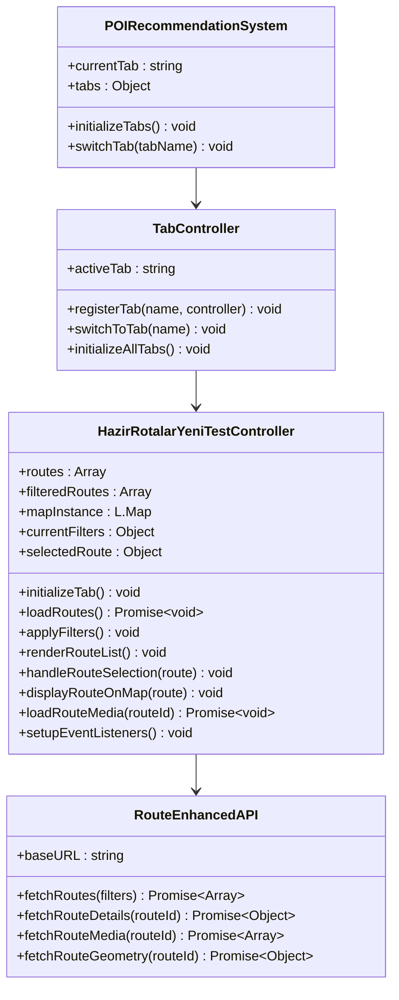
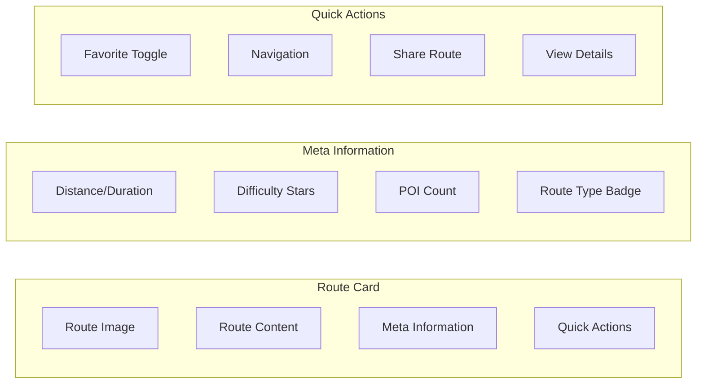
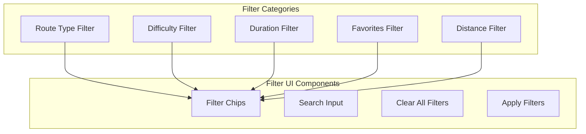
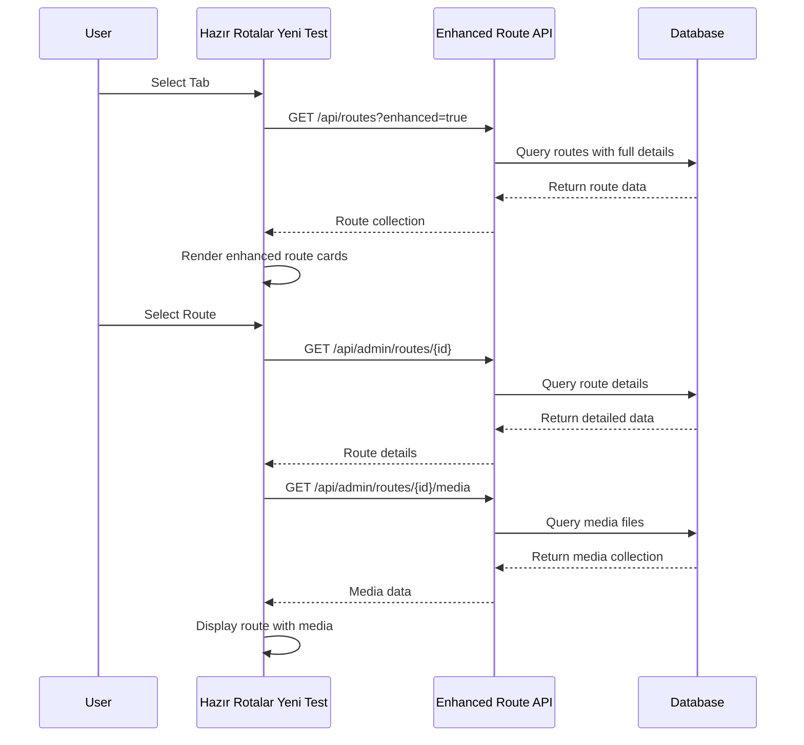
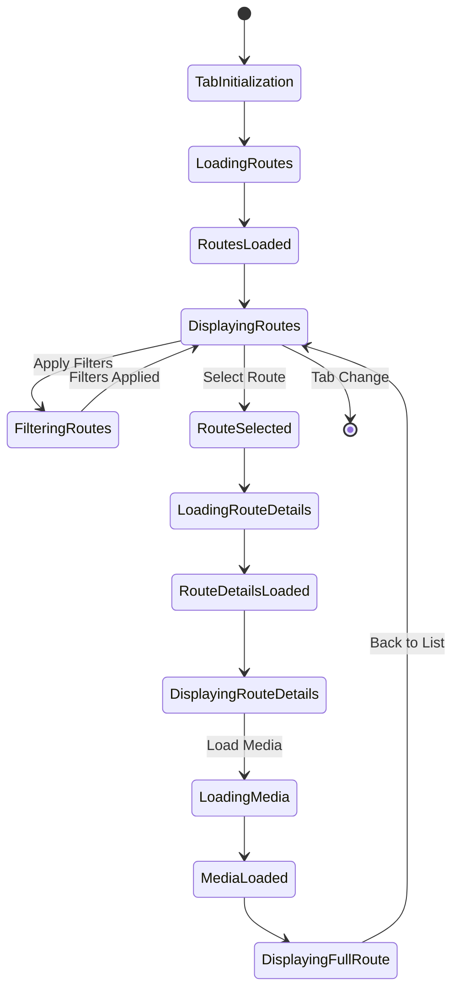
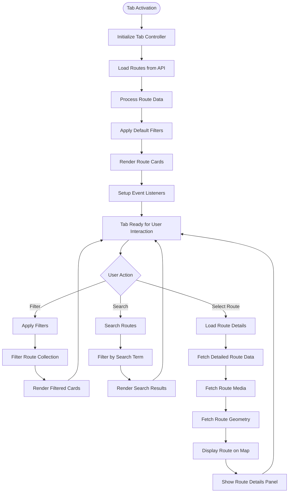
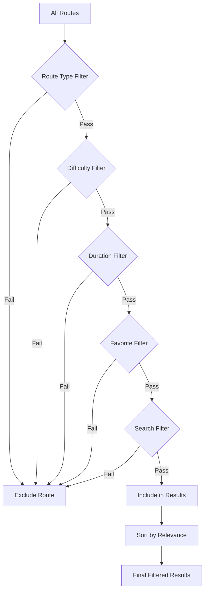
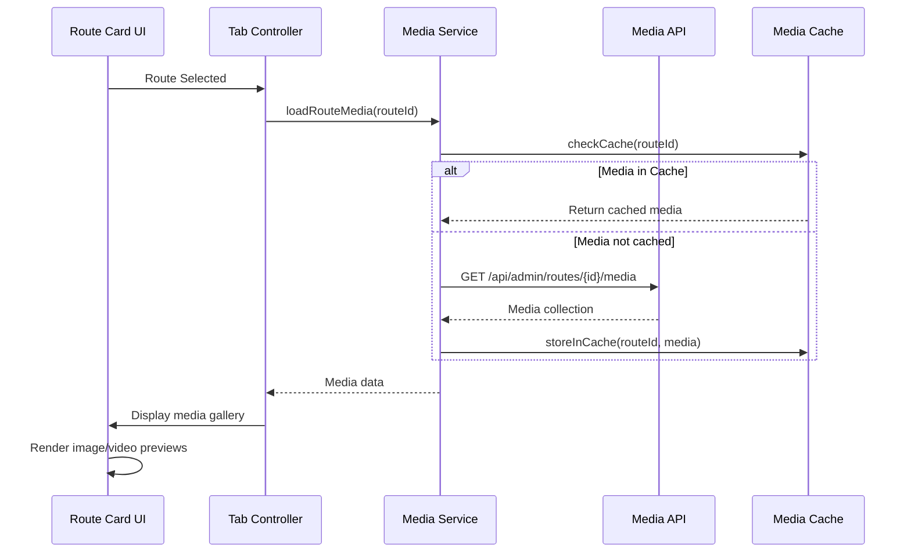
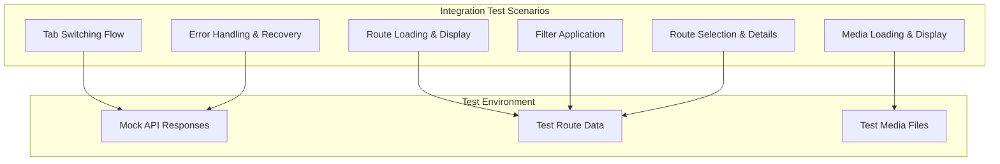
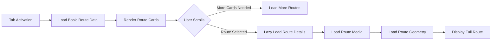

# POI Recommendation System Tab Enhancement: "Hazır Rotalar Yeni Test" Feature

## Overview
This design document outlines the implementation of a new third tab called "Hazır Rotalar Yeni Test" in the POI recommendation system (`poi_recommendation_system.html`). This new tab will provide an alternative ready-made routes interface that leverages the existing backend functionality from `route_manager_enhanced.html`.

## Architecture

### Tab Integration Architecture
```mermaid
graph TB
    subgraph "POI Recommendation System"
        TabContainer[Tab Container]
        DynamicTab[Kişisel Tercihlerime Göre Rotalar]
        PredefinedTab[Hazır Rotalar]
        NewTestTab[Hazır Rotalar Yeni Test]
        
        TabContainer --> DynamicTab
        TabContainer --> PredefinedTab
        TabContainer --> NewTestTab
    end
    
    subgraph "Backend Services"
        RouteAPI[Route API /api/routes]
        AdminAPI[Admin API /api/admin/routes]
        MediaAPI[Media API /api/admin/routes/{id}/media]
    end
    
    subgraph "Enhanced Features"
        RouteManager[Route Manager Enhanced Features]
        FilterSystem[Advanced Filter System]
        MediaManagement[Media Management]
        RouteGeometry[Route Geometry Handling]
    end
    
    NewTestTab --> RouteAPI
    NewTestTab --> AdminAPI
    NewTestTab --> MediaAPI
    NewTestTab --> RouteManager
    NewTestTab --> FilterSystem
    NewTestTab --> MediaManagement
    NewTestTab --> RouteGeometry
```

### Component Hierarchy


## UI Components

### Tab Navigation Enhancement
The existing tab structure will be extended to include a third tab:

| Tab | Icon | Label | Data Source |
|-----|------|-------|-------------|
| dynamic-routes | fas fa-sliders-h | Kişisel Tercihlerime Göre Rotalar | POI Recommendation Engine |
| predefined-routes | fas fa-route | Hazır Rotalar | Basic Route API |
| **hazir-rotalar-yeni-test** | **fas fa-cogs** | **Hazır Rotalar Yeni Test** | **Enhanced Route Manager API** |

### Enhanced Route Display Components

#### Route Card Template


#### Advanced Filter System


## API Integration Layer

### Enhanced Route API Endpoints
The new tab will utilize the following API endpoints from the route manager enhanced system:

| Endpoint | Method | Purpose | Response |
|----------|--------|---------|----------|
| `/api/routes` | GET | List all routes with filters | Route collection with pagination |
| `/api/admin/routes/{id}` | GET | Get detailed route information | Complete route object |
| `/api/admin/routes/{id}/media` | GET | Get route media files | Media collection |
| `/api/routes/{id}/geometry` | GET | Get route geometry data | GeoJSON route path |
| `/api/admin/routes/{id}/pois` | GET | Get route POI associations | POI collection |

### API Client Integration


## Data Flow Architecture

### State Management


### Data Processing Pipeline


## Business Logic Layer

### Route Management Service
The new tab will implement an enhanced route management service that extends the existing functionality:

#### Core Methods
| Method | Parameters | Return Type | Description |
|--------|------------|-------------|-------------|
| `loadEnhancedRoutes()` | filters: Object | Promise<Array> | Load routes with enhanced data |
| `applyAdvancedFilters()` | filterConfig: Object | Array | Apply multiple filter criteria |
| `getRouteWithMedia()` | routeId: number | Promise<Object> | Get route with associated media |
| `optimizeRouteDisplay()` | routes: Array | Array | Optimize route data for display |
| `handleRouteInteraction()` | route: Object, action: string | void | Handle user interactions |

#### Filter Logic


### Media Handling Strategy
The enhanced tab will implement advanced media handling:

#### Media Loading Workflow


## Testing Strategy

### Unit Testing
| Component | Test Cases | Coverage Target |
|-----------|------------|----------------|
| Tab Controller | Tab switching, initialization, cleanup | 90% |
| Route API Client | API calls, error handling, data transformation | 95% |
| Filter System | Filter combinations, edge cases, performance | 85% |
| Media Handler | Loading, caching, error states | 90% |

### Integration Testing


## Performance Optimizations

### Lazy Loading Strategy


### Caching Strategy
| Data Type | Cache Duration | Storage Method |
|-----------|----------------|----------------|
| Route List | 5 minutes | Memory Cache |
| Route Details | 10 minutes | Memory Cache |
| Route Media | 30 minutes | IndexedDB |
| Route Geometry | 60 minutes | IndexedDB |

## Security Considerations

### API Security
- All API calls will use existing authentication middleware
- CSRF tokens will be included in state-changing requests
- Rate limiting will be implemented for API calls
- Input validation for all filter parameters

### Content Security
- Media files will be validated before display
- XSS prevention for user-generated content
- Secure handling of route data and coordinates