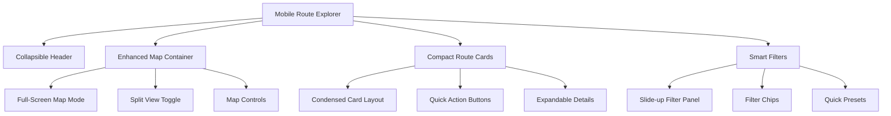

# POI Recommendation System Mobile Optimization Design

## Overview

The POI Recommendation System currently faces significant mobile usability issues in the predefined routes section. Users report that the map is barely visible and route cards are oversized for mobile screens. This design addresses these issues with a mobile-first approach that prioritizes map visibility and optimizes the overall mobile experience.

## Technology Stack & Dependencies

- **Frontend Framework**: Vanilla HTML5/CSS3/JavaScript
- **Map Library**: Leaflet.js
- **UI Framework**: Bootstrap 5.3.0
- **Icons**: Font Awesome 6.0.0
- **Responsive Design**: CSS Grid, Flexbox, Media Queries
- **Touch Optimization**: Custom touch interaction handlers

## Mobile User Experience Problems

### Current Issues
1. **Map Visibility**: Map container height is only 350px on mobile, making route visualization difficult
2. **Route Card Size**: Cards occupy too much vertical space, requiring excessive scrolling
3. **Layout Priority**: Map is not prominently featured as the primary interface element
4. **Touch Interaction**: Suboptimal touch targets and interaction patterns

### User Impact
- Poor navigation experience due to limited map visibility
- Inefficient route browsing requiring excessive scrolling
- Reduced engagement with map-based features
- Frustration with mobile interface usability

## Proposed Mobile-First Architecture

### Component Hierarchy Redesign



### Mobile Layout Strategy

#### 1. Progressive Disclosure
- **Primary View**: Prominent map with minimal UI chrome
- **Secondary View**: Compact route list with essential information
- **Tertiary View**: Detailed route information on demand

#### 2. Adaptive Screen Real Estate
- **Map Priority**: 60% screen height on mobile viewports
- **Route Cards**: Compressed layout with essential data
- **Filters**: Slide-up overlay to preserve screen space

## Responsive Design Specifications

### Breakpoint Strategy
```css
/* Mobile First Approach */
@media (max-width: 480px) {
  /* Small Mobile - 320px to 480px */
  --map-height-mobile: 65vh;
  --card-height-mobile: 120px;
  --card-grid-columns: 1;
}

@media (min-width: 481px) and (max-width: 768px) {
  /* Large Mobile/Small Tablet - 481px to 768px */
  --map-height-tablet: 55vh;
  --card-height-tablet: 140px;
  --card-grid-columns: 1;
}

@media (min-width: 769px) and (max-width: 1024px) {
  /* Tablet - 769px to 1024px */
  --map-height-desktop: 500px;
  --card-height-desktop: 160px;
  --card-grid-columns: 2;
}
```

### Map Container Optimization

#### Enhanced Mobile Map
- **Height**: Increase from 350px to 65vh (viewport height based)
- **Full-Screen Mode**: Toggle for immersive map experience
- **Quick Actions**: Floating action buttons for common operations
- **Touch Gestures**: Enhanced pan, zoom, and tap interactions

#### Map Controls Redesign
```css
.mobile-map-controls {
  position: absolute;
  bottom: 20px;
  right: 20px;
  display: flex;
  flex-direction: column;
  gap: 12px;
  z-index: 1000;
}

.map-control-btn-mobile {
  width: 56px;
  height: 56px;
  border-radius: 28px;
  background: rgba(255, 255, 255, 0.95);
  backdrop-filter: blur(10px);
  box-shadow: 0 4px 12px rgba(0, 0, 0, 0.15);
  border: none;
  display: flex;
  align-items: center;
  justify-content: center;
  font-size: 20px;
  color: #333;
  transition: all 0.3s ease;
}
```

### Route Card Optimization

#### Compact Card Design
- **Height Reduction**: From 200px+ to 120px maximum
- **Information Density**: Strategic content prioritization
- **Visual Hierarchy**: Enhanced typography and spacing
- **Touch Targets**: Minimum 44px for interactive elements

#### Card Layout Architecture
```css
.route-card-mobile {
  display: grid;
  grid-template-columns: 80px 1fr 60px;
  grid-template-rows: auto auto;
  height: 120px;
  border-radius: 16px;
  overflow: hidden;
  box-shadow: 0 2px 8px rgba(0, 0, 0, 0.1);
  margin-bottom: 12px;
}

.route-card-thumbnail {
  grid-row: 1 / 3;
  width: 80px;
  height: 120px;
  object-fit: cover;
}

.route-card-content-mobile {
  padding: 12px 16px;
  display: flex;
  flex-direction: column;
  justify-content: space-between;
}

.route-card-actions {
  grid-row: 1 / 3;
  display: flex;
  flex-direction: column;
  justify-content: space-around;
  align-items: center;
  padding: 8px;
}
```

## Enhanced Mobile Features

### 1. Smart Layout Switching
- **Map-First Mode**: Map takes 70% of screen, list compressed
- **List-First Mode**: Traditional card grid with map minimized
- **Split Mode**: 50/50 horizontal split for larger mobile screens

### 2. Progressive Loading
- **Route Cards**: Lazy loading with skeleton screens
- **Map Tiles**: Prioritized loading for viewport area
- **Images**: Progressive JPEG with blur-up technique

### 3. Touch Interaction Enhancements
- **Swipe Gestures**: Horizontal swipe between routes
- **Pull-to-Refresh**: Update route data and map
- **Long Press**: Quick access to route context menu

## Mobile-Specific Components

### Slide-up Filter Panel
```css
.mobile-filter-panel {
  position: fixed;
  bottom: 0;
  left: 0;
  right: 0;
  background: white;
  border-radius: 20px 20px 0 0;
  max-height: 70vh;
  transform: translateY(calc(100% - 80px));
  transition: transform 0.3s cubic-bezier(0.4, 0, 0.2, 1);
  z-index: 2000;
}

.mobile-filter-panel.expanded {
  transform: translateY(0);
}
```

### Route Quick Actions
- **Heart Icon**: Favorite/unfavorite toggle
- **Navigation Arrow**: Direct to navigation app
- **Share Icon**: Share route with others
- **Info Icon**: Expand for detailed information

### Floating Action Button
- **Primary Action**: Switch between map and list view
- **Secondary Actions**: Filter, search, refresh
- **Material Design**: 56px diameter, elevation shadow

## Performance Optimizations

### Mobile-Specific Optimizations
1. **Reduced Image Sizes**: WebP format with fallbacks
2. **CSS Grid over Flexbox**: Better performance for card layouts
3. **Intersection Observer**: Lazy loading for off-screen content
4. **Touch Debouncing**: Prevent accidental multiple taps

### Memory Management
- **Map Tile Caching**: Intelligent cache strategy for mobile data
- **Route Data Pagination**: Load routes in batches
- **Image Preloading**: Strategic preloading for smooth scrolling

## Implementation Phases

### Phase 1: Map Enhancement (Week 1)
- Increase map height to 65vh on mobile
- Implement full-screen map toggle
- Redesign map controls for mobile touch

### Phase 2: Route Card Optimization (Week 2)
- Implement compact card design
- Add thumbnail images and quick actions
- Optimize card grid layout

### Phase 3: Advanced Mobile Features (Week 3)
- Implement slide-up filter panel
- Add swipe gestures and touch interactions
- Progressive loading implementation

### Phase 4: Performance & Polish (Week 4)
- Performance optimizations
- Cross-device testing
- Accessibility improvements

## Testing Strategy

### Device Testing Matrix
- **iPhone SE**: 375x667 (smallest modern screen)
- **iPhone 12**: 390x844 (standard modern mobile)
- **Samsung Galaxy S21**: 384x854 (Android reference)
- **iPad Mini**: 768x1024 (small tablet)

### Testing Scenarios
1. **Map Interaction**: Zoom, pan, marker selection
2. **Route Browsing**: Scroll performance, card interactions
3. **Filter Usage**: Panel operation, filter application
4. **Network Conditions**: 3G simulation, offline mode

### Performance Metrics
- **First Contentful Paint**: < 2.5s on 3G
- **Time to Interactive**: < 4s on mobile devices
- **Cumulative Layout Shift**: < 0.1
- **Touch Response Time**: < 100ms

## Accessibility Considerations

### Mobile Accessibility
- **Touch Target Size**: Minimum 44px as per WCAG guidelines
- **Color Contrast**: 4.5:1 ratio for normal text
- **Focus Management**: Logical tab order for keyboard users
- **Screen Reader Support**: Proper ARIA labels and landmarks

### Gesture Accessibility
- **Alternative Actions**: Tap alternatives for all swipe gestures
- **Reduced Motion**: Respect prefers-reduced-motion
- **Voice Control**: Compatible with voice navigation

## Future Enhancements

### Advanced Mobile Features
1. **Augmented Reality**: Camera overlay for route visualization
2. **Offline Mode**: Downloaded maps and route data
3. **Location Services**: GPS-based route recommendations
4. **Push Notifications**: Route updates and recommendations

### Integration Opportunities
- **Native App Shell**: Progressive Web App features
- **Device APIs**: Geolocation, compass, accelerometer
- **Social Features**: Route sharing and community ratings