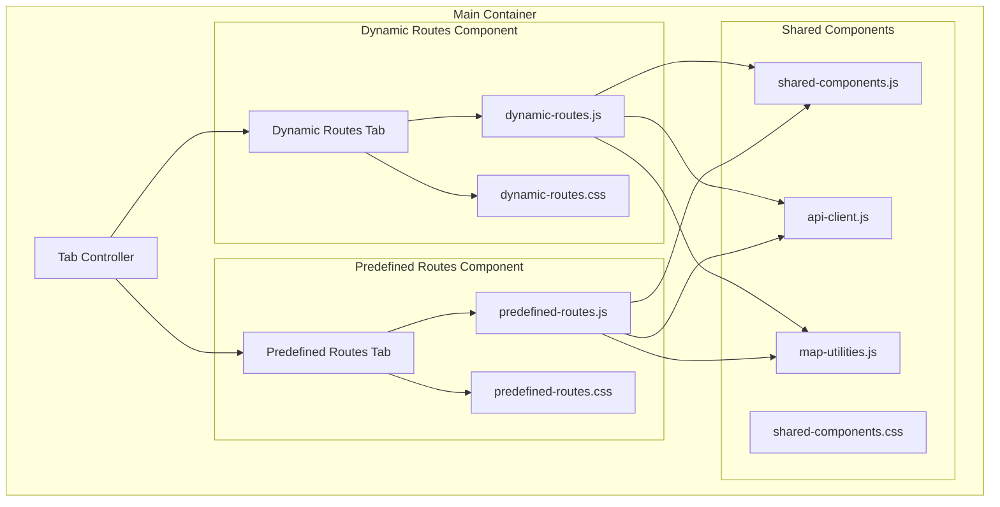
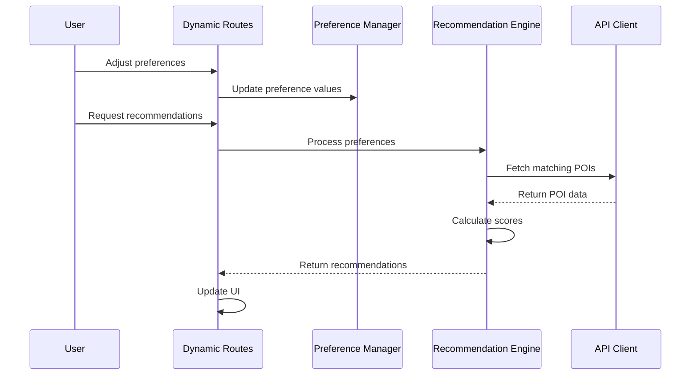
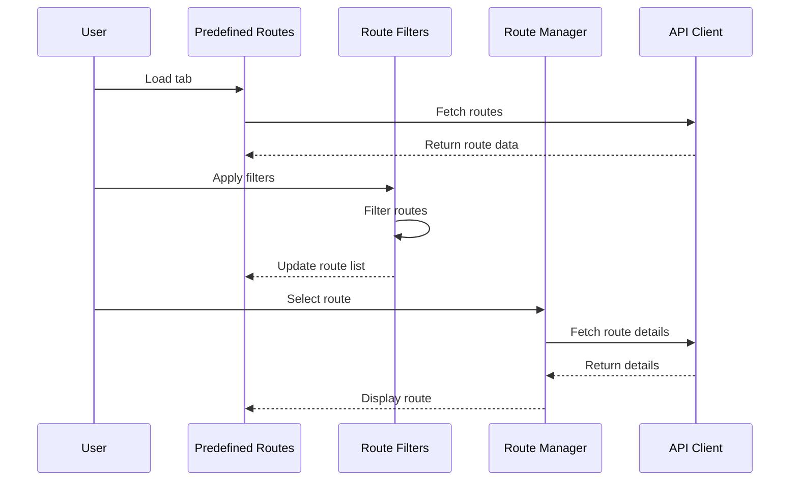

# POI Tabs Separation Design

## Overview

This design outlines the separation of the POI recommendation system from a single monolithic HTML page with shared JavaScript and CSS into two completely independent tab components. Each tab will have its own dedicated JavaScript modules, CSS stylesheets, and isolated functionality while maintaining the existing user experience.

## Current Architecture Analysis

The current `poi_recommendation_system.html` implements two tabs:
- **Dynamic Routes Tab**: Personal preference-based route recommendations
- **Predefined Routes Tab**: Pre-configured route browsing and filtering

### Current Issues
- Single monolithic JavaScript file (`poi_recommendation_system.js` - 458.5KB)
- Shared CSS file (`poi_recommendation_system.css` - 233.4KB) 
- Tightly coupled components with shared global variables
- No clear separation of concerns between tab functionalities
- Performance impact from loading unused code
- Maintenance complexity due to code entanglement

## Target Architecture

### Component Structure



## File Structure Design

### JavaScript Module Organization

```
static/js/
├── poi-tabs/
│   ├── tab-controller.js          # Main tab management
│   ├── dynamic-routes/
│   │   ├── dynamic-routes.js      # Dynamic routes main logic
│   │   ├── preference-manager.js  # User preference handling
│   │   ├── recommendation-engine.js # Recommendation processing
│   │   └── route-builder.js       # Route creation logic
│   ├── predefined-routes/
│   │   ├── predefined-routes.js   # Predefined routes main logic
│   │   ├── route-filters.js       # Filtering functionality
│   │   ├── route-list-manager.js  # List view management
│   │   └── route-map-manager.js   # Map view management
│   └── shared/
│       ├── api-client.js          # API communication
│       ├── map-utilities.js       # Map helper functions
│       ├── elevation-chart.js     # Elevation visualization
│       ├── media-modal.js         # Media viewer
│       └── ui-components.js       # Reusable UI elements
```

### CSS Organization

```
static/css/poi-tabs/
├── shared/
│   ├── base-styles.css            # Common variables and base styles
│   ├── components.css             # Shared UI components
│   └── responsive.css             # Mobile-first responsive design
├── dynamic-routes/
│   ├── dynamic-routes.css         # Tab-specific styles
│   ├── preference-sliders.css     # Slider components
│   └── recommendation-cards.css   # Result display styles
└── predefined-routes/
    ├── predefined-routes.css      # Tab-specific styles
    ├── route-filters.css          # Filter UI styles
    ├── route-cards.css            # Route card components
    └── route-map.css              # Map view styles
```

## Component Specifications

### Tab Controller

**Responsibilities:**
- Initialize and manage tab switching
- Handle lazy loading of tab components
- Coordinate shared resource cleanup
- Manage global state isolation

**Key Methods:**
```javascript
class TabController {
    async initializeTab(tabName)
    async switchTab(fromTab, toTab)
    cleanupTab(tabName)
    registerTabComponent(name, component)
}
```

### Dynamic Routes Component

**Core Features:**
- User preference collection via interactive sliders
- POI recommendation algorithm integration
- Route visualization and optimization
- Interactive map with custom markers

**State Management:**
```javascript
class DynamicRoutesState {
    preferences: Object
    recommendations: Array
    selectedPOIs: Array
    routePreview: Object
    mapInstance: L.Map
}
```

### Predefined Routes Component

**Core Features:**
- Route browsing with advanced filtering
- Map and list view toggle
- Route details modal
- Favorite routes management

**State Management:**
```javascript
class PredefinedRoutesState {
    routes: Array
    filteredRoutes: Array
    activeFilters: Object
    selectedRoute: Object
    viewMode: 'map' | 'list'
}
```

## Data Flow Architecture

### Dynamic Routes Flow



### Predefined Routes Flow



## Shared Components Design

### API Client Module

**Purpose:** Centralized API communication with rate limiting and caching

```javascript
class APIClient {
    async getRecommendations(preferences)
    async getPredefinedRoutes(filters)
    async getRouteDetails(routeId)
    async getRouteMedia(routeId)
    cacheResponse(key, data)
    rateLimitRequest(endpoint)
}
```

### Map Utilities Module

**Purpose:** Common map functionality for both tabs

```javascript
class MapUtilities {
    createMap(containerId, options)
    addMarkers(map, pois, options)
    createRoutePreview(map, coordinates)
    fitMapToBounds(map, bounds)
    destroyMap(map)
}
```

### Elevation Chart Module

**Purpose:** Reusable elevation visualization component

```javascript
class ElevationChart {
    constructor(containerId, options)
    updateData(elevationData)
    highlightSegment(startIndex, endIndex)
    destroy()
}
```

## CSS Architecture

### Design Token System

```css
/* Base design tokens */
:root {
    /* Colors */
    --primary-color: #2d3748;
    --secondary-color: #4a5568;
    --accent-color: #3182ce;
    
    /* Spacing */
    --spacing-xs: 4px;
    --spacing-sm: 8px;
    --spacing-md: 16px;
    --spacing-lg: 24px;
    --spacing-xl: 32px;
    
    /* Breakpoints */
    --mobile: 480px;
    --tablet: 768px;
    --desktop: 1024px;
    
    /* Touch targets */
    --touch-target-min: 44px;
}
```

### Component-Based Styling

Each component follows BEM methodology:

```css
/* Dynamic Routes Example */
.dynamic-routes {}
.dynamic-routes__header {}
.dynamic-routes__preferences {}

.preference-slider {}
.preference-slider__track {}
.preference-slider__thumb {}
.preference-slider--active {}

.recommendation-card {}
.recommendation-card__header {}
.recommendation-card__content {}
.recommendation-card--selected {}
```

## Performance Optimizations

### Lazy Loading Strategy

- Load tab-specific code only when tab is first accessed
- Implement module splitting for better caching
- Use dynamic imports for non-critical functionality

### Memory Management

```javascript
class ComponentManager {
    register(name, cleanup)
    cleanup(component)
    cleanupAll()
}

// Example cleanup for dynamic routes
function cleanupDynamicRoutes() {
    // Destroy map instances
    // Clear event listeners
    // Reset state variables
    // Cancel pending requests
}
```

### Bundle Optimization

- Separate bundles for each tab component
- Common chunks for shared utilities
- Tree shaking for unused code elimination

## Migration Strategy

### Phase 1: Extract Shared Components
1. Create shared utility modules (API client, map utilities)
2. Extract common UI components
3. Establish design token system

### Phase 2: Separate Tab Logic
1. Create tab-specific modules
2. Implement state isolation
3. Set up component communication interfaces

### Phase 3: CSS Reorganization
1. Split CSS into component-specific files
2. Implement modular stylesheet loading
3. Optimize for critical path rendering

### Phase 4: Integration and Testing
1. Implement tab controller
2. Test component isolation
3. Performance testing and optimization

## Testing Strategy

### Unit Testing
- Test each component in isolation
- Mock shared dependencies
- Validate state management

### Integration Testing
- Test tab switching functionality
- Verify component communication
- Test shared resource cleanup

### Performance Testing
- Bundle size analysis
- Load time measurements
- Memory usage monitoring

## Benefits

### Development Benefits
- **Modularity**: Clear separation of concerns
- **Maintainability**: Easier to modify individual components
- **Testability**: Components can be tested in isolation
- **Scalability**: Easy to add new tabs or features

### Performance Benefits
- **Reduced Initial Load**: Only essential code loads initially
- **Better Caching**: Component-specific bundles cache independently
- **Memory Efficiency**: Unused components don't consume memory
- **Faster Navigation**: Tab switching doesn't reload unnecessary code

### User Experience Benefits
- **Faster Page Load**: Critical path optimization
- **Smoother Interactions**: Reduced JavaScript execution time
- **Better Mobile Performance**: Optimized for mobile-first design
- **Progressive Enhancement**: Features load as needed