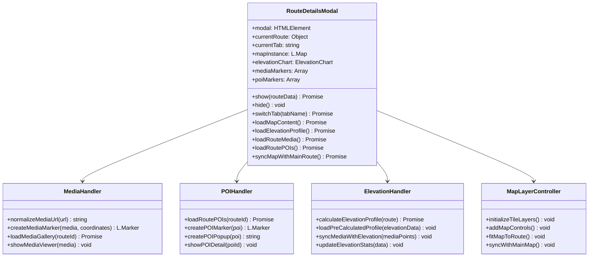
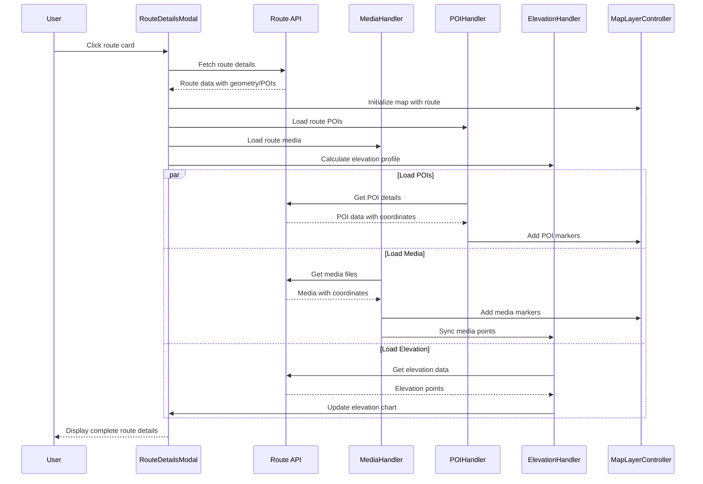

# Route Modal Enhancement Design

## Overview

This design document outlines the enhancement of the route details modal in the predefined routes section (`poi_recommendation_system.html`) to provide a comprehensive, mobile-optimized interface that matches the functionality of the main routes map. The enhanced modal will display media markers, POI details, and calculated elevation profiles with full map layer integration.

## Problem Statement

The current route details modal in the predefined routes tab has several critical issues:

1. **Media Display Errors**: Media files are not loading properly, causing display errors
2. **Missing POI Markers**: Route-associated POIs are not displayed on the modal map
3. **Empty Elevation Profile**: Elevation profile calculations are not working, showing empty charts
4. **Inconsistent Map Functionality**: The modal map lacks the same features as the main predefined routes map
5. **Layer Integration Issues**: Map layers and visual elements are not properly synchronized

## Requirements

### Functional Requirements

#### FR1: Media Display and Integration
- Display all media types (images, videos, audio, 3D models) associated with the route
- Show media markers on the map with proper type-specific styling
- Synchronize media markers between map and elevation chart
- Handle media URL normalization using `/poi_media/` base path
- Provide media viewer functionality within the modal

#### FR2: POI Markers and Details
- Display all POIs associated with the route on the modal map
- Show POI markers with category-specific icons and colors
- Provide detailed POI popups with description, category, and actions
- Enable POI detail modal access from route modal map markers

#### FR3: Elevation Profile Calculation
- Calculate and display accurate elevation profiles for routes
- Support both pre-calculated elevation data and real-time calculation
- Show elevation statistics (min, max, ascent, descent)
- Synchronize elevation chart with map markers and media points

#### FR4: Map Layer Consistency
- Implement identical map functionality to the main predefined routes map
- Support multiple tile layers (OpenStreetMap, satellite, topographic)
- Include map controls (zoom, fullscreen, layer switching)
- Maintain consistent marker styling and interaction patterns

### Non-Functional Requirements

#### NFR1: Performance
- Load modal content progressively to avoid blocking UI
- Cache map instances and data to prevent redundant API calls
- Optimize media loading with lazy loading and fallback handling

#### NFR2: Mobile Responsiveness
- Maintain tabbed interface for optimal mobile UX
- Ensure touch-friendly interactions for all map controls
- Adapt content layout for various screen sizes

#### NFR3: Error Handling
- Gracefully handle missing or corrupted media files
- Provide fallback content for failed elevation calculations
- Show appropriate loading states and error messages

## Architecture

### Component Structure



### Data Flow



## Implementation Strategy

### Phase 1: Media Display Enhancement

#### Media URL Normalization
- Implement media URL handling using `/poi_media/` base path standard
- Handle various input formats (full paths, relative paths, filenames)
- Provide fallback placeholder images for invalid URLs

```javascript
// Media URL normalization function
function normalizeMediaUrl(url) {
    if (!url) return 'https://via.placeholder.com/150x150?text=No+Image';
    
    // Preserve absolute URLs
    if (url.startsWith('http://') || url.startsWith('https://') || url.startsWith('/')) {
        return url;
    }
    
    // Extract relative part from paths containing poi_media
    if (url.includes('poi_media/')) {
        const parts = url.split('poi_media/');
        return `/poi_media/${parts[parts.length - 1]}`;
    }
    
    // Prefix simple filenames
    return `/poi_media/${url}`;
}
```

#### Media Marker Creation
- Create type-specific markers (orange for images, red for videos, green for audio, purple for 3D models)
- Implement media popup content with viewer integration
- Synchronize media markers with elevation chart

### Phase 2: POI Integration

#### POI Data Loading
- Fetch complete POI data for the route including coordinates and details
- Create category-specific POI markers with consistent styling
- Implement POI popup content with navigation to detailed view

#### POI Marker Styling
- Use consistent category colors and icons matching main map
- Implement hover effects and interactive states
- Support POI sequence numbering for route order

### Phase 3: Elevation Profile Enhancement

#### Elevation Calculation
- Support both pre-calculated elevation profiles and real-time calculation
- Handle different data sources (geometry coordinates, POI waypoints)
- Implement fallback calculation methods

#### Chart Integration
- Use ElevationChart class for consistent visualization
- Synchronize media markers with elevation chart
- Update elevation statistics display

### Phase 4: Map Layer Consistency

#### Map Initialization
- Replicate main map functionality within modal
- Support multiple tile layers and map controls
- Implement consistent zoom and pan behavior

#### Layer Synchronization
- Ensure modal map matches main map styling
- Sync map state and selected layers
- Implement consistent marker clustering if needed

## Technical Specifications

### Map Tab Enhancement

The map tab will be enhanced to include:

1. **Full Map Functionality**
   - Identical tile layer options to main map
   - Map controls (zoom, fullscreen, layer switching)
   - Consistent marker styling and interactions

2. **Elevation Profile Integration**
   - Move elevation profile from overview to map tab
   - Synchronize elevation chart with map markers
   - Interactive elevation chart with marker highlighting

3. **Media and POI Markers**
   - Display all route media with location markers
   - Show route POIs with category-specific styling
   - Implement popup content for both media and POIs

### Data Integration Points

#### Route Data Structure
```javascript
{
    id: "route_id",
    name: "Route Name",
    description: "Route description",
    geometry: {
        type: "LineString",
        coordinates: [[lng, lat], ...]
    },
    elevation_profile: {
        points: [{distance: 0, elevation: 100}, ...]
    },
    pois: [{
        id: "poi_id",
        name: "POI Name",
        category: "category_key",
        lat: 38.6431,
        lng: 34.8286,
        description: "POI description"
    }],
    media: [{
        id: "media_id",
        media_type: "image",
        filename: "photo.jpg",
        latitude: 38.6431,
        longitude: 34.8286,
        poi_id: "associated_poi_id"
    }]
}
```

#### API Endpoints
- `GET /routes/{id}` - Fetch complete route details
- `GET /routes/{id}/media` - Get route media with coordinates
- `GET /routes/{id}/pois` - Get route POIs with details
- `GET /routes/{id}/elevation` - Get elevation profile data

### Error Handling and Fallbacks

#### Media Loading Errors
- Use placeholder images for missing media files
- Gracefully handle network errors during media loading
- Provide retry mechanisms for failed media requests

#### Elevation Calculation Failures
- Show appropriate error messages for elevation service failures
- Implement fallback elevation calculation using POI coordinates
- Cache successful elevation data to prevent repeated calculations

#### Map Loading Issues
- Provide loading indicators during map initialization
- Handle tile layer loading failures gracefully
- Implement fallback map providers if primary fails

## Testing Strategy

### Unit Testing
- Test media URL normalization functions
- Verify POI marker creation and styling
- Test elevation profile calculation accuracy
- Validate error handling for missing data

### Integration Testing
- Test modal integration with main map functionality
- Verify data synchronization between map and elevation chart
- Test responsive behavior across device sizes
- Validate API integration and error handling

### User Acceptance Testing
- Test complete user workflow from route selection to detailed view
- Verify media viewing and POI interaction functionality
- Test navigation between modal tabs and content loading
- Validate mobile touch interactions and responsive design

## Migration and Rollout

### Development Phases
1. **Phase 1**: Media display enhancement and URL normalization
2. **Phase 2**: POI integration and marker consistency
3. **Phase 3**: Elevation profile calculation and chart integration
4. **Phase 4**: Map layer consistency and full functionality

### Backward Compatibility
- Maintain existing modal structure and CSS classes
- Ensure existing event handlers continue to work
- Provide graceful degradation for unsupported features

### Performance Considerations
- Implement progressive loading for modal content
- Cache map instances and reuse when possible
- Optimize media loading with lazy loading strategies
- Monitor and optimize API call frequency